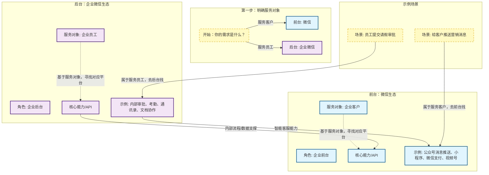

微信和企业微信分别对应企业前台和后台。前台服务的是企业的客户，后台服务的是企业的员工。因此可以根据要服务的对象去寻找对应的能力和API。例如要给客户推送消息，则应该去前台能力寻找。而后台的智能客服也可以赋能前台。
帮我画个图，这种关系。

好的，我为您绘制了一个展示微信和企业微信关系的图表。

这个图表的核心逻辑是**“基于服务对象（客户 vs 员工）”**来区分前台和后台，并展示了它们之间相互赋能的关系。

### 图表说明：

1.  **顶层决策（黄色虚线框）**：这是您提到的“根据要服务的对象去寻找对应的能力和API”的起点。任何需求首先都要问自己：是给客户用的，还是给员工用的？

2.  **前台 - 微信（蓝色区域）**：
    *   **角色**：企业的“门面”，直接面对市场。
    *   **对象**：企业客户。
    *   **能力**：所有与客户触点相关的功能都在这里，比如您提到的“给客户推送消息”。

3.  **后台 - 企业微信（紫色区域）**：
    *   **角色**：企业的“内功”，支撑内部运营。
    *   **对象**：企业员工。
    *   **能力**：提升内部效率的工具，比如审批、考勤等。

4.  **关键连接（赋能）**：
    *   图中有一条从**企业微信**指向**微信**的箭头，特别标注了“智能客服能力”。这展示了后台如何赋能前台：企业内部的客服团队（在企业微信）可以通过集成的能力，高效地服务前台的客户（在微信）。

5.  **示例场景**：底部给出了两个具体例子，帮助您理解如何将实际需求映射到对应的平台。

希望这个图能清晰地帮您理清微信生态中的这种前台与后台协作关系！